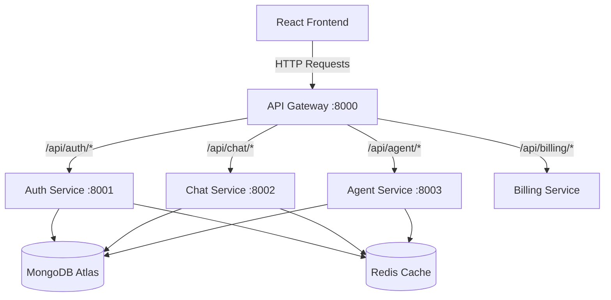
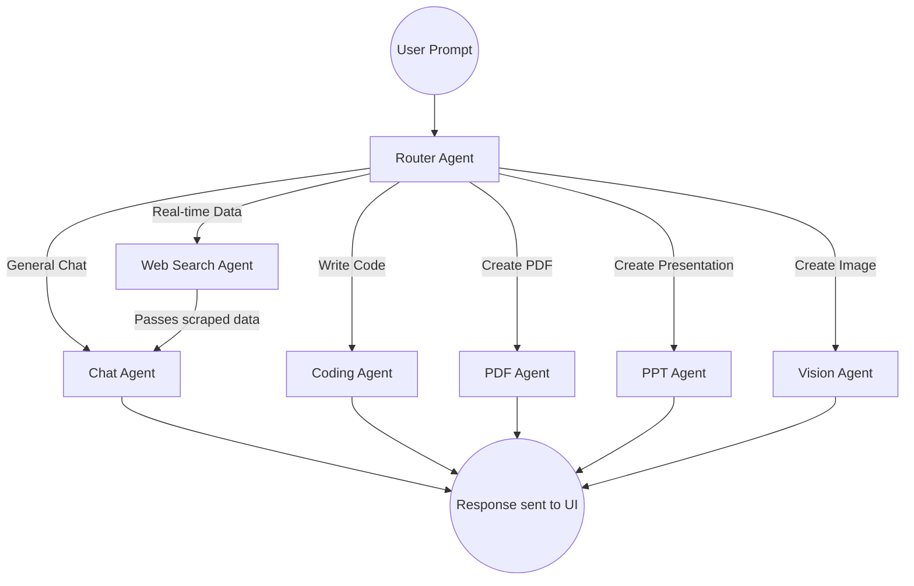

# 🚀 Cortex AI - Multi-Agent AI Platform

Cortex AI is an advanced, production-ready Multi-Agent Artificial Intelligence platform. Built with a Microservices architecture, it leverages LangChain and LangGraph to intelligently route user queries to specialized AI agents. It goes beyond a simple chatbot by supporting live web search, code generation with a live preview artifact, PDF/PPT generation, and image generation. 

## ✨ Key Features

* **🧠 Multi-Agent Architecture (LangGraph)**: An intelligent Router Agent dynamically routes user prompts to the most appropriate specialized agent (Chat, Search, Coding, PDF, PPT, or Vision).
* **🔌 Microservices Backend**: Highly scalable backend divided into API Gateway, Auth Service, Chat Service, and Agent Service.
* **🔐 Authentication & Session Management**: Secure Google OAuth via Firebase, with secure session caching stored in Redis.
* **💬 Persistent Chat Memory**: Conversations and messages are saved in MongoDB and cached in Redis for lightning-fast retrieval and context-aware AI memory.
* **💻 Interactive Artifacts**: The Coding Agent generates UI code that is instantly previewed in an interactive right-hand artifact panel.
* **🌐 Real-Time Web Search**: Integrated with Tavily Search API to scrape and fetch the latest internet data, complete with image results.
* **💳 Monetization / Credits System**: Integrated with Razorpay for user billing and AI credit purchases.
* **🐳 Dockerized Services**: Redis and internal dependencies are containerized for easy deployment.

---

## 🛠️ Tech Stack

**Frontend:**
* **React.js (Vite)** & **Tailwind CSS** for ultra-fast, responsive UI.
* **Redux Toolkit** for centralized state management.
* **React Markdown** & **React Syntax Highlighter** for beautiful AI response formatting.

**Backend:**
* **Node.js** & **Express.js** handling API routing and microservices.
* **MongoDB Atlas** (Mongoose) for primary database storage.
* **Redis (ioredis)** for in-memory caching, rate-limiting, and session management.
* **http-proxy-middleware** for the API Gateway.

**AI & Agents:**
* **LangChain** & **LangGraph** for orchestrating multi-agent workflows.
* **Groq API**, **Google Gemini (2.5 Flash)**, & **DeepSeek** for diverse LLM capabilities.
* **Tavily Search API** for web scraping.


## 🏗️ System Architecture

### 1. Microservices Architecture
The backend is decoupled into independent services managed by an API Gateway.



### 2. LangGraph Multi-Agent Workflow

When a user sends a prompt, the **Router Agent** analyzes the intent and passes the context to a specialized worker node.



---

## 📂 Full Project Structure

```text
Cortex-AI/
├── client/                         # React.js Frontend (Vite)
│   ├── src/
│   │   ├── components/             # Reusable UI (Sidebar, ChatArea, Artifacts, MessageBubble)
│   │   ├── features/               # API Call Wrappers (Axios instances)
│   │   ├── pages/                  # Main views (Home.jsx)
│   │   ├── redux/                  # Redux Toolkit (store.js, userSlice, chatSlice)
│   │   ├── utils/                  # Firebase SDK config, Axios setup
│   │   ├── App.jsx
│   │   └── main.jsx
│   ├── tailwind.config.js
│   └── package.json
│
├── server/                         # Node.js Microservices
│   ├── gateway/                    # Main Entry Proxy (Port 8000)
│   │   ├── middleware/             # Auth Protections, Proxy Forwarder
│   │   └── index.js
│   │
│   ├── services/
│   │   ├── auth/                   # Auth & User Creation (Port 8001)
│   │   │   ├── config/             # Firebase Admin JSON, DB connections
│   │   │   ├── controllers/        # Login, Logout logic
│   │   │   ├── models/             # Mongoose User Schema
│   │   │   ├── routes/
│   │   │   └── index.js
│   │   │
│   │   ├── chat/                   # Conversations & Messages (Port 8002)
│   │   │   ├── controllers/        
│   │   │   ├── models/             # Conversation & Message Schemas
│   │   │   ├── routes/
│   │   │   └── index.js
│   │   │
│   │   └── agent/                  # AI & LangGraph Execution (Port 8003)
│   │       ├── agents/             # Chat, Search, Coding, PDF, PPT, Vision logic
│   │       ├── config/             # LLM Model setup, Memory logic
│   │       ├── controllers/        # Main Prompt Receiver
│   │       ├── graph/              # LangGraph Workflow & State Management
│   │       ├── routes/
│   │       └── index.js
│   │
│   ├── shared/                     # Shared packages (Redis connection wrapper)
│   ├── docker-compose.yml          # Containerizes Redis database
│   └── package.json
└── README.md
```

---

## ⚙️ Environment Variables

Create a `.env` file in the root of the **Frontend**, **Gateway**, and **each Microservice**.

**Frontend (`frontend/.env`):**

```env
VITE_SERVER_URL=http://localhost:8000
VITE_FIREBASE_API_KEY=your_firebase_api_key
# Add other Firebase config keys...

```

**API Gateway (`backend/gateway/.env`):**

```env
PORT=8000
FRONTEND_URL=http://localhost:5173
AUTH_SERVICE_URL=http://localhost:8001
CHAT_SERVICE_URL=http://localhost:8002
AGENT_SERVICE_URL=http://localhost:8003
REDIS_URL=redis://localhost:6379

```

**Agent Service (`backend/services/agent/.env`):**

```env
PORT=8003
MONGODB_URI=your_mongodb_atlas_connection_string
REDIS_URL=redis://localhost:6379
GROQ_API_KEY=your_groq_api_key
GEMINI_API_KEY=your_gemini_api_key
TAVILY_API_KEY=your_tavily_search_api_key

```

*(Provide respective `PORT`, `MONGODB_URI` and `FIREBASE_ADMIN` variables for Auth and Chat services).*

---

## 🚀 Installation & Setup

### 1. Prerequisites

* **Node.js** (v18+)
* **Docker Desktop** (For running Redis locally)
* A **MongoDB Atlas** Account
* A **Firebase** Account (With Google Auth enabled & Service Account JSON generated)

### 2. Start Redis via Docker

Navigate to the backend root directory and start the background services:

```bash
cd backend
docker-compose up -d

```

### 3. Install Backend Dependencies & Start Microservices

You will need to install packages in the gateway and all services. Open separate terminal instances for each:

**Gateway:**

```bash
cd backend/gateway
npm install
npm run dev

```

**Auth Service:**

```bash
cd backend/services/auth
npm install
npm run dev

```

**Chat Service:**

```bash
cd backend/services/chat
npm install
npm run dev

```

**Agent Service:**

```bash
cd backend/services/agent
npm install
npm run dev

```

### 4. Start the Frontend

```bash
cd frontend
npm install
npm run dev

```

Navigate to `http://localhost:5173` in your browser.

---

## 🤝 Contribution & License

This repository includes an MIT license. See [`LICENSE`](LICENSE).